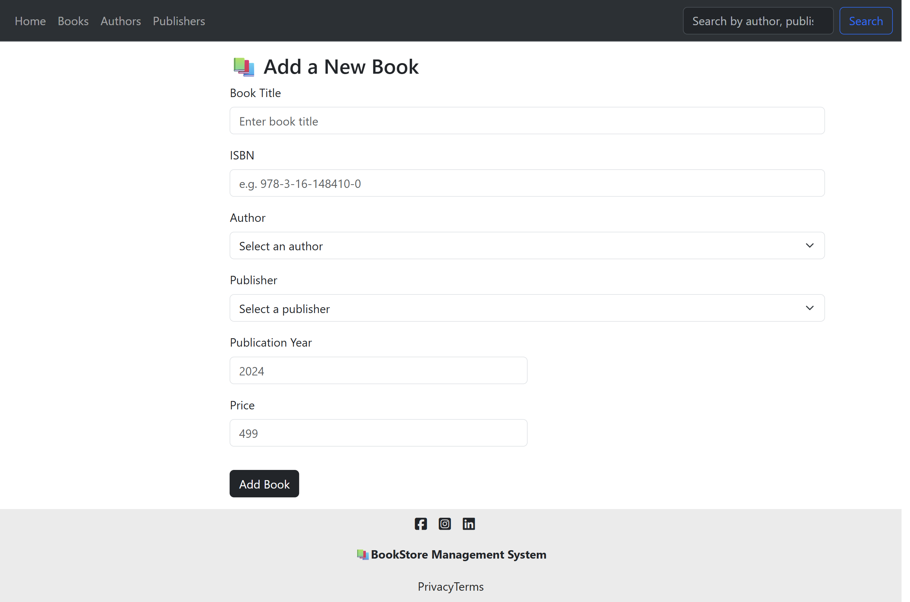
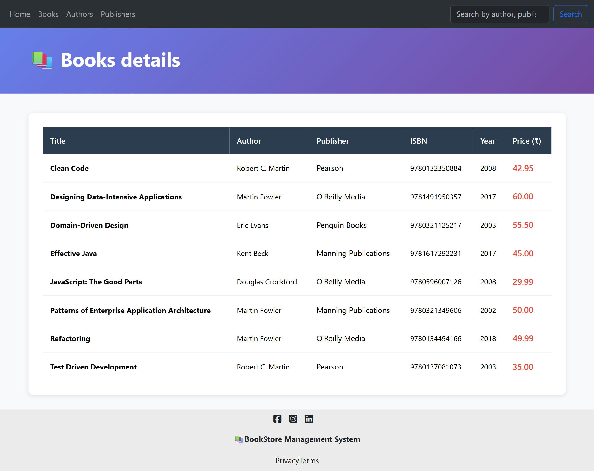
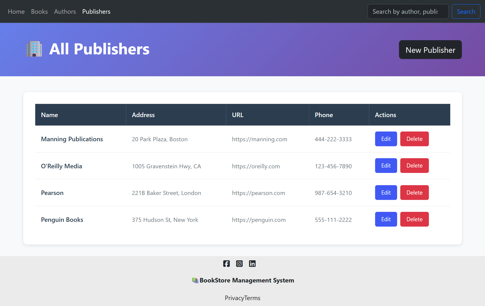

# 📚 Book Store Management System

A full-stack **Book Store Management System** built with **Node.js**, **Express**, **PostgreSQL**, and **EJS**, allowing management of books, authors, and publishers. This project includes features such as adding, editing, deleting, and searching records, with a clean and interactive UI.

---

## 🌟 Features

### Books
- Add new books with title, ISBN, author, publisher, year, and price.
- Edit and update book details, including author and publisher associations.
- Delete books while maintaining database integrity (removes references in BookAuthor table).
- View all books with author and publisher details.
- Search books by:
  - **Author name** → displays all books by the author.
  - **Publisher name** → displays all books by the publisher.
  - **Book ISBN** → displays the specific book.
  - **Book title** → displays the specific book.

### Authors
- Add, edit, and delete authors.
- Maintain relationship with books in BookAuthor table.

### Publishers
- Add, edit, and delete publishers.
- Updating a publisher’s name automatically updates associated books.
- Deletes books associated with a publisher when the publisher is deleted.

### UI
- Interactive dashboard showing most recently released books.
- Consistent and responsive layout using Bootstrap.
- Search bar in navbar with dynamic results display.
- Footer stays at the bottom of all pages.

---

## 🏗️ Tech Stack

- **Backend:** Node.js, Express.js
- **Database:** PostgreSQL
- **ORM / Querying:** `pg-promise`
- **Templating Engine:** EJS + ejs-mate
- **Middleware:** 
  - `express.json`, `express.urlencoded`  
  - `method-override` for PUT/DELETE  
  - Custom `wrapAsync` for error handling  
  - Validation middleware for books, authors, and publishers

- **Frontend:** HTML, CSS, Bootstrap

---

## 📁 Project Structure (MVC)
```
├── 📁 controllers
│   ├── 📄 authorController.js
│   ├── 📄 bookController.js
│   └── 📄 publisherController.js
├── 📁 middleware
│   ├── 📄 errorHandler.js
│   └── 📄 validation.js
├── 📁 public
│   ├── 📁 css
│   │   ├── 🎨 authAndPub.css
│   │   ├── 🎨 books.css
│   │   ├── 🎨 footer.css
│   │   ├── 🎨 home.css
│   │   └── 🎨 style.css
│   └── 📁 js
│       └── 📄 formValidation.js
├── 📁 routes
│   ├── 📄 authorRoutes.js
│   ├── 📄 bookRoutes.js
│   └── 📄 publisherRoutes.js
├── 📁 screenshots
│   ├── 🖼️ add_book_page.png
│   ├── 🖼️ authors_page.png
│   ├── 🖼️ book_edit-page.png
│   ├── 🖼️ books_detail_page.png
│   ├── 🖼️ home_page.png
│   └── 🖼️ publishers_page.png
├── 📁 utils
│   └── 📄 wrapAsync.js
├── 📁 views
│   ├── 📁 authors
│   │   ├── 📄 edit.ejs
│   │   ├── 📄 new.ejs
│   │   └── 📄 show.ejs
│   ├── 📁 books
│   │   ├── 📄 all.ejs
│   │   ├── 📄 edit.ejs
│   │   ├── 📄 new.ejs
│   │   ├── 📄 searchResults.ejs
│   │   └── 📄 show.ejs
│   ├── 📁 includes
│   │   ├── 📄 footer.ejs
│   │   └── 📄 navbar.ejs
│   ├── 📁 layouts
│   │   └── 📄 boilerplate.ejs
│   ├── 📁 publishers
│   │   ├── 📄 edit.ejs
│   │   ├── 📄 new.ejs
│   │   └── 📄 show.ejs
│   ├── 📄 error.ejs
│   └── 📄 home.ejs
├── ⚙️ .gitignore
├── 📄 LICENSE
├── 📝 README.md
├── 📄 app.js
├── 📄 db.js
├── ⚙️ package-lock.json
└── ⚙️ package.json
```


---

## 🚀 Getting Started

### Prerequisites
- Node.js (v18+ recommended)
- PostgreSQL database

### Installation
1. Clone the repository:
```bash
git clone https://github.com/SiddheshKharade07/Book-store-management-system.git
```
2.Navigate into the project directory:
```bash
cd Book-store-management-system
```
3.Install dependencies:
```bash
npm install
```
4.Set up your PostgreSQL database and configure connection in db.js.


5.Run the app:
```bash
npm start
```
6.Open your browser at:
```bash
http://localhost:8080
```

## 📌 Usage

- Navigate to `/books`, `/authors`, or `/publishers` to manage entities.  
- Use the navbar search to find books by title, ISBN, author, or publisher.  
- Use the **Add/Edit/Delete** buttons to modify records.  
- Dashboard on the home page shows total counts and most recent books.  

### 🖼️ Screenshots

#### Home Page


#### Add Book Page


#### Books Detail Page


#### Edit Book Page


#### Authors Page


#### Publisher Page



---

## 📜 License

This project is licensed under the **MIT License**. See the [LICENSE](LICENSE) file for details.

---

## 💡 Future Enhancements

- User authentication and roles (Admin/Visitor)  
- Sorting and filtering books by price, year, or publisher  
- Pagination for books and authors list  
- Export data to CSV/Excel  
- Improve UI with modern frameworks (React/Vue)

---

